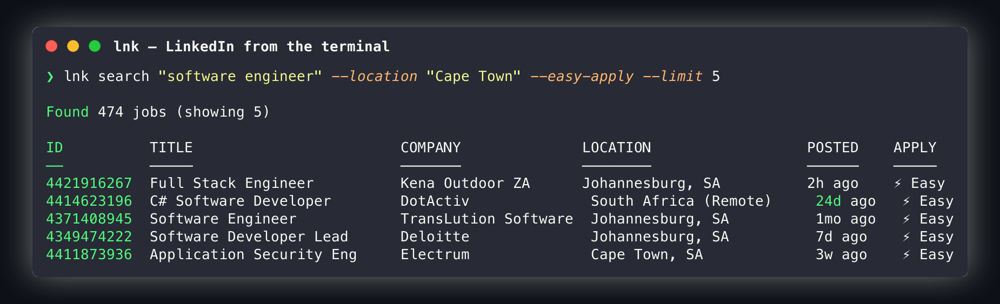

# 🔗 lnk — LinkedIn from the terminal


Search jobs, view profiles, apply — all from your shell. Built on LinkedIn's Voyager API, reverse-engineered from the Android APK.



## Install

**Homebrew (recommended):**

```bash
brew install yashiels/tap/lnk
```

**Go install:**

```bash
go install github.com/yashiels/linkedin-cli/cmd/lnk@latest
```

**Pre-built binaries:**

Download from the [Releases](https://github.com/yashiels/linkedin-cli/releases) page (macOS arm64/amd64, Linux arm64/amd64).

## Quickstart

```bash
lnk auth login                    # paste your li_at cookie
lnk search "software engineer" --location "Cape Town" --easy-apply
lnk job 4414623196                # view full job details
lnk apply 4414623196 --dry-run    # preview Easy Apply
lnk profile johndoe               # view any profile
lnk feed --limit 10               # recommended jobs
```

## Commands

### auth

Manage LinkedIn session credentials.

```
lnk auth login     Store li_at and JSESSIONID cookies (interactive prompt)
lnk auth status    Show current authentication state
lnk auth logout    Remove stored credentials
```

Credentials are stored in `~/.config/lnk/credentials.json` with `0600` permissions.
You can also supply them via environment variables — see [Configuration](#configuration).

---

### search

Search job postings with powerful filters.

```
lnk search <keywords> [flags]
```

| Flag | Short | Default | Description |
|---|---|---|---|
| `--location` | `-l` | | Location name or geo URN |
| `--type` | `-t` | | Comma-separated job types: `full-time`, `part-time`, `contract`, `temporary`, `volunteer`, `internship` |
| `--experience` | `-e` | | Comma-separated levels: `entry`, `associate`, `mid-senior`, `director`, `executive` |
| `--easy-apply` | | false | Filter for Easy Apply jobs only |
| `--remote` | | false | Filter for remote jobs |
| `--sort` | | `relevant` | Sort order: `recent` or `relevant` |
| `--limit` | `-n` | `25` | Maximum results to return |
| `--posted` | | | Posted within: `24h`, `week`, `month` |

**Examples:**

```bash
lnk search "backend engineer" --location "London" --type full-time --easy-apply
lnk search "product manager" --remote --posted week --sort recent
lnk search "data scientist" --experience entry,mid-senior --limit 50 --json
```

---

### job

View full details for a specific job posting.

```
lnk job <job-id> [flags]
```

| Flag | Description |
|---|---|
| `--open` | Open the job URL in your default browser |

**Example:**

```bash
lnk job 4414623196
lnk job 4414623196 --open
lnk job 4414623196 --json
```

---

### apply

Apply to a job via Easy Apply.

```
lnk apply <job-id> [flags]
```

| Flag | Description |
|---|---|
| `--dry-run` | Show what would be submitted without actually applying |
| `--confirm` | Skip the confirmation prompt and apply immediately |

**Examples:**

```bash
lnk apply 4414623196 --dry-run    # preview the submission
lnk apply 4414623196              # apply with confirmation prompt
lnk apply 4414623196 --confirm    # apply without prompt
```

---

### saved

Manage your saved jobs.

```
lnk saved list [flags]
lnk saved add <job-id>
lnk saved remove <job-id>
```

| Flag (list) | Default | Description |
|---|---|---|
| `--limit` | `25` | Maximum results to return |

**Examples:**

```bash
lnk saved list
lnk saved list --limit 50 --json
lnk saved add 4414623196
lnk saved remove 4414623196
```

---

### feed

Browse your personalised job recommendations.

```
lnk feed [flags]
```

| Flag | Short | Default | Description |
|---|---|---|---|
| `--limit` | `-n` | `25` | Maximum results to return |

**Example:**

```bash
lnk feed
lnk feed --limit 10 --json
```

---

### profile

View a LinkedIn member profile.

```
lnk profile [username] [flags]
```

Omit `username` to view your own profile. The username is the slug from the LinkedIn
profile URL: `https://www.linkedin.com/in/<username>`

**Examples:**

```bash
lnk profile                        # your own profile
lnk profile satyanadella           # another member's profile
lnk profile yashielsookdeo --json  # output as JSON
```

---

### alerts

Manage LinkedIn job alert subscriptions.

```
lnk alerts list
lnk alerts create [flags]
lnk alerts delete <alert-id>
```

| Flag (create) | Default | Description |
|---|---|---|
| `--keywords` | required | Job search keywords |
| `--location` | | Location filter (city, country, or Remote) |
| `--frequency` | `daily` | Email frequency: `daily` or `weekly` |

**Examples:**

```bash
lnk alerts list
lnk alerts create --keywords "software engineer" --location "Cape Town"
lnk alerts create --keywords "product manager" --location "Remote" --frequency weekly
lnk alerts delete 111222333
```

---

### status

Show authentication state, configuration, and API connectivity.

```
lnk status [flags]
```

```bash
lnk status
lnk status --json
```

---

### completion

Generate shell completion scripts.

```bash
# Bash — source immediately
source <(lnk completion bash)

# Bash — persist across sessions
lnk completion bash > ~/.local/share/bash-completion/completions/lnk

# Zsh
lnk completion zsh > "${fpath[1]}/_lnk"

# Fish
lnk completion fish > ~/.config/fish/completions/lnk.fish

# PowerShell
lnk completion powershell | Out-String | Invoke-Expression
```

---

## Global Flags

These flags work with every command:

| Flag | Short | Description |
|---|---|---|
| `--json` | | Output as JSON (machine-readable) |
| `--plain` | | Output as tab-separated text (pipe-friendly) |
| `--no-color` | | Disable ANSI colour codes |
| `--quiet` | `-q` | Suppress informational messages |
| `--verbose` | | Log HTTP requests to stderr |
| `--debug` | | Log full HTTP request/response bodies to stderr |
| `--no-input` | | Fail instead of prompting for input |
| `--config` | | Path to config file (overrides default) |

## Configuration

**Config file:** `~/.config/lnk/config.toml`

```toml
[defaults]
location = "Cape Town, South Africa"
sort     = "relevant"   # or "recent"
limit    = 25

[display]
color = true
```

**Credentials file:** `~/.config/lnk/credentials.json`

**Environment variables:**

| Variable | Description |
|---|---|
| `LNK_LI_AT` | LinkedIn `li_at` session cookie (overrides stored credentials) |
| `LNK_CONFIG` | Path to config file |
| `LNK_DEBUG` | Set to `1` to enable debug HTTP logging |
| `NO_COLOR` | Disable ANSI colour output ([no-color.org](https://no-color.org)) |

Setting `LNK_LI_AT` lets you use `lnk` in CI/CD pipelines without writing
credentials to disk.

## How It Works

Reverse-engineered from the LinkedIn Android APK v4.1.1209 using standard
decompilation tools. Requests go to `https://www.linkedin.com/voyager/api/graphql`
and REST sub-paths under `/voyager/api/` using the same HTTP headers the official
Android client sends. 481 API queries extracted. Variable encoding uses the RestLi
protocol (`internal/restli`). Auth via session cookies (`li_at` + `JSESSIONID`).

Because this relies on LinkedIn's internal API:

- **It may break** if LinkedIn updates or deprecates endpoints.
- **Rate-limiting is possible** — the client backs off on HTTP 429 responses.
- **LinkedIn's Terms of Service** may prohibit automated access.

## Disclaimer

Unofficial tool. Not affiliated with, endorsed by, or supported by LinkedIn
Corporation. Use at your own risk. May break if LinkedIn updates their API.
For personal and research use only.

## License

MIT — see [LICENSE](LICENSE).

Copyright (c) 2025 Yashiel Sookdeo
